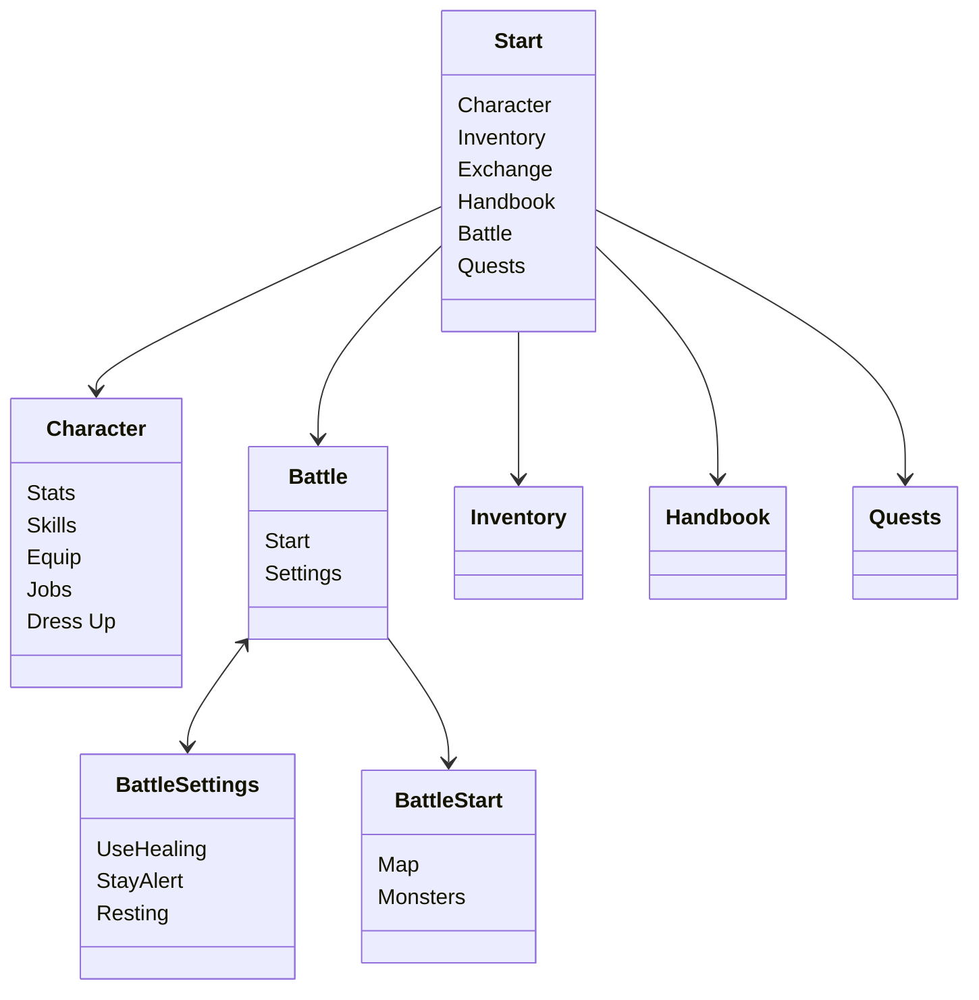

# Idle RPG

## Servers
The bot will be joining multiple discord servers, where it will need a channel to live in. Can have 2 channels, one for control, and another one for event messages (player achievements like changing job, leveling milestones)

## Character

In this game you build your character. Your character has a base level and a job level. Based on your base level, you can distribute stats primary. The stats will be dynamic, but for the initial game they will be

- Strength (increases physical attack and a bit of def)
- Intelligence (increases magic attack and a bit of magic def)
- Agility (increase flee and attack speed))
- Dexterity (increases hit and ranged physical attack))
- Luck (increases critical hit chance)
- Vitality (increases HP and def)

These stats are used, combined with buffs and equipment into secondary, calculated stats. These stats will have a dependency graph!

- HP
- MP
- Attack
- Defense
- Magic Attack
- Magic Defense
- Hit
- Flee

There will be intermediate stats to further complicate the mechanics

- Attack Element
- Defense Element, Race, Size

These stats and the stats of enemies will be used to calculate the basic attack damage, as well as skill damage. For enemies, some stats could have manual overrides, instead of being all calculated. This could also be done with automatic buffs on the MVPs to keep the world consistent

### Jobs

Jobs will have specific skills linked to them, having different values to parties. You will be able to have 1 active job and grow that through a job tree. In the example version, you will be able to change to the last job into a tree line whenever you want, but only one job can be active. Enabling job switching allows for people to stay flexible and switch if they are bored of the job they picked, and to allow for more content to explore.


## Idle levelling

The basic method of levelling is auto-battling. The player can use the following menu structure

Only the maps surrounding the map locations surrounding the location he has already visited will be visible. Locations can be a region on the world map (seamless world map???), or a dungeon floor.

You'll be able to set the skills you want to use for auto battling

## Menu Structure



Fighting monsters will gain experience, job experience and item drops. The items will be stored automatically, and can be exchange at the market

```//TODO: should there be a daily cap?```


## Questing

Questing will be done through the quest-button in the main interface. When clicking on the quest menu, you get a list of the available quests. These will be story-related quests, but will start off with quests for changing jobs. Questing will be done through discord button interactions, where you get a picture of the quest (scenery + character image), with some dialog and buttons to progress through. 

Sometimes within a quest you'll have to move to a different location, fight specific monsters, or gather specific items. As the game will be simulated, these things will take time, but you can set them up with the quest button. Not sure how to make this fun though, and not a "just wait 30 seconds until you can click again". This could be done by adding navigation through buttons, like a classic text-adventure RPG. This could be mini-dungeons, where you click directions to change rooms, and then either fight monsters in turnbased style with your skills, and have some tiny key-door puzzles. 

Quest board could be for daily missions of killing x monsters, or collecting y items. These quests can be done in parallel with the auto-battling.


## Events

Events will be the main way for social interaction and showing off your character and playing together

### Random MVP spawns
MVPs will spawn randomly in channels that have people actively chatting. After a certain timeout (2 hours), every message posted in a chat will have a random chance of an MVP spawning. This will give a message with a button in the chat, which will open a private battle window to not spam the main chat too much. Everybody who joins in will support the rest of the members, and will get a share of the loot. Could have a specific loot distribution system, based on level/equip/power level? Options:
- Automatic battling. Everybody who joins will autocast the skills they have setup in a specific menu beforehand. Will make the battle automatic, so no interaction needed
- Manual battling. Battling will be tick or turn based. Every 10 seconds you fire off a skill, or after skill cooldown? Issue with this is latency and activity, but will allow for a bit more strategy


### Weekly instances
Make a team beforehand and do a specific instance? maybe make a video of the result?

## Guilds
Guilds could be discord servers. You pick what discord server you belong to as a group. No idea what guilds could add to the game though. It could be used for auto-GVG battling? will be hard to add some interaction or strategy in here though. It could happen as an auto-battle and you just get the rewards or something. These events could be simulated, rendered and then posted?