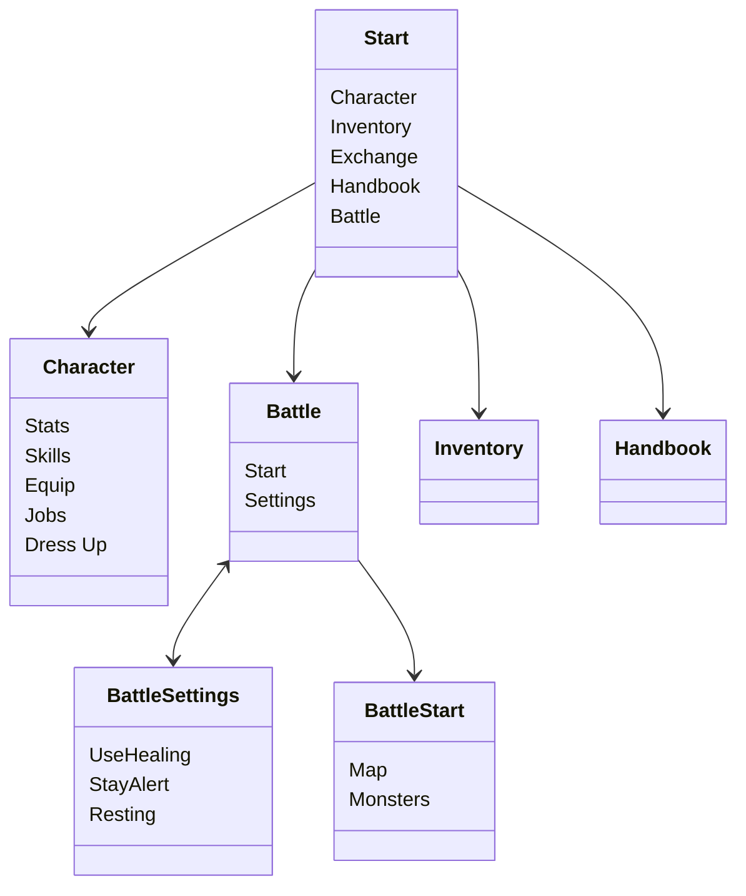

# Idle RPG

## Servers
The bot will be joining multiple discord servers, where it will need a channel to live in. Can have 2 channels, one for control, and another one for event messages (player achievements like changing job, leveling milestones)

## Character

In this game you build your character. Your character has a base level and a job level. Based on your base level, you can distribute stats primary. The stats will be dynamic, but for the initial game they will be

- Strength
- Intelligence
- Agility
- Dexterity
- Luck
- Vitality

These stats are used, combined with buffs and equipment into secondary, calculated stats. These stats will have a dependency graph!

- HP
- MP
- Attack
- Defense
- Magic Attack
- Magic Defense
- Hit
- Miss

There will be intermediate stats to further complicate the mechanics

- Attack Element
- Defense Element, Race, Size

## Idle levelling

The basic method of levelling is auto-battling. The player can use the following menu structure

Only the maps surrounding the map locations surrounding the location he has already visited will be visible. Locations can be a region on the world map (seamless world map???), or a dungeon floor.




Fighting monsters will gain experience, job experience and item drops. The items will be stored automatically, and can be exchange at the market

```//TODO: should there be a daily cap?```


## Questing

no idea how to do this yet, but we'll need some kind of quests to unlock new classes.

Quest board could be for daily missions of killing x monsters, or collecting y items. These quests can be done in parallel with the auto-battling.


## Events

Events will be the main way for social interaction and showing off

### Random MVP spawns
MVPs will spawn randomly in channels that have people actively chatting. After a certain timeout (2 hours), every message posted in a chat will have a random chance of an MVP spawning. This will give a message with a button in the chat, which will open a private battle window to not spam the main chat too much. Everybody who joins in will support the rest of the members, and will get a share of the loot. Could have a specific loot distribution system, based on level/equip/power level? Options:
- Automatic battling. Everybody who joins will autocast the skills they have setup in a specific menu beforehand. Will make the battle automatic, so no interaction needed
- Manual battling. Battling will be tick or turn based. Every 10 seconds you fire off a skill, or after skill cooldown? Issue with this is latency and activity, but will allow for a bit more strategy


### Weekly instances
Make a team beforehand and do a specific instance? maybe make a video of the result?

## Guilds
Guilds could be discord servers. You pick what discord server you belong to as a group. No idea what guilds could add to the game though